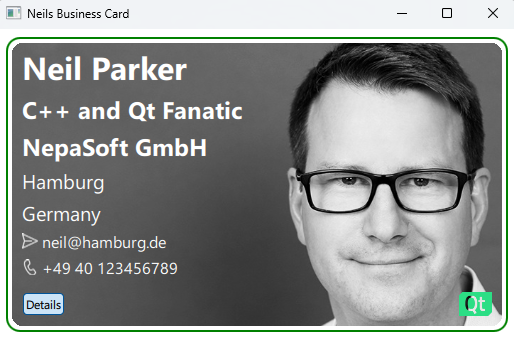

# QML-Challenges
Qt QML Learning Challenges

## 1_BusinessCard

### Stretched target
- Custom Items for setting common properties for colour etc
- Custom Item for the background image to improve readability and structure
- Custom Item for the open URL Icon 
- Rounded corners of the background image using MultiEffects
- Animation for the detail text 
- Build in named icons for the phone number and email
- Layouts
